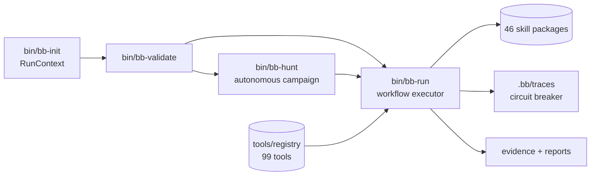

# BountyHarness

[](https://github.com/Mr-Neutr0n/bounty-harness/actions/workflows/ci.yml)
[](LICENSE)


**BountyHarness** is an open-source agent harness for authorized bug bounty and application security research.

> **Site:** [bounty-harness-site.vercel.app](https://bounty-harness-site.vercel.app) · **Docs:** [bounty-harness-site.vercel.app/docs.html](https://bounty-harness-site.vercel.app/docs.html)

It gives security agents a disciplined operating model: a thin command harness for context, scope, tools, and execution, plus fat skill packages that hold the actual workflows, scripts, runbooks, payloads, evidence rules, and reporting guidance.

Use it only on systems you own or are explicitly authorized to test.

## Why This Exists

Modern bug bounty work is not one scanner. It is a loop:

1. Understand the target and scope.
2. Build an asset and application model.
3. Pick techniques that fit the exposed surfaces.
4. Run focused workflows with rate limits and safety tiers.
5. Turn noisy outputs into verified, evidence-backed findings.
6. Write a report that a program can actually validate.

BountyHarness packages that loop into reusable, inspectable workflows so an agent does not need to invent a new pipeline every time.

## Demo


Reproducible with [VHS](https://github.com/charmbracelet/vhs): `vhs docs/demo.tape`.

## Architecture



- **Thin harness** (`bin/`): context init, validation, workflow execution, autonomous campaigns. No security logic lives here.
- **Fat skills** (`.claude/skills/<skill>/`): `SKILL.md` router, machine-executable `skill.yaml`, scripts, runbooks, payloads.
- **Governance layer**: safety tiers, circuit breaker, scope guardrails, tracing, secret scanning in CI.

## Install

### curl installer (macOS + Linux)

```bash
curl -fsSL https://raw.githubusercontent.com/Mr-Neutr0n/bounty-harness/main/install.sh | sh -s --
```

or from a clone:

```bash
git clone https://github.com/Mr-Neutr0n/bounty-harness.git && cd bounty-harness
./install.sh                      # into this dir, or set INSTALL_DIR=/path
uninstall.sh                      # remove symlinks; PURGE=1 to delete the tree
```

The installer verifies python3 >= 3.11 + PyYAML + git (printing exact fixes for anything missing), clones or pulls the repo, smoke-tests it, and symlinks the five binaries into `~/.local/bin` (falls back to `/usr/local/bin`).

### Homebrew

```bash
brew install mr-neutr0n/bounty-harness/bounty-harness
# or: brew tap mr-neutr0n/bounty-harness && brew install bounty-harness
```

The formula lives in [homebrew-bounty-harness](https://github.com/Mr-Neutr0n/homebrew-bounty-harness); pushing a `v*` tag to the main repo builds the release archive and its sha256 automatically. Old `homebrew-tap` URLs still redirect.

## Quick Start

```bash
bb-init example.com --program example --scope-file scope.txt
bb-run list                          # see all 46 skills
bb-run recon list                    # see a skill's workflows
bb-hunt https://example.com --time-budget 1h   # autonomous campaign
```

## Highlights

- **46 skill packages** covering recon, XSS, SQLi, SSRF, RCE, auth, API, file upload, CORS/CSRF, race conditions, cloud, mobile, LLM security, HTTP protocol bugs, CI/CD, GraphQL, web3, identity infrastructure, reporting, and more.
- **Autonomous campaigns** with `bin/bb-hunt`: context init, recon, domain modeling, technique matching, planning, priority-ordered execution, and reporting from one URL.
- **Thin harness, fat skills**: the harness dispatches; the skills contain the security logic.
- **Tool registry** for install, health checks, version locking, capability mapping, and risk tiers across 99 external tools.
- **Safety model** with passive, active-safe, intrusive, and destructive-manual tiers; circuit breaker blocks a target after repeated consecutive failures.
- **Scope-aware workflows** with rate limits, local-only output, and explicit evidence standards.
- **Planning and knowledge systems**: domain model, technique KB, coverage ledger, program memory (with negative-result tracking), asset graph, traffic corpus, and vulnerability intelligence.
- **Workflow tracing**: every run records timing, safety tier, tools used, and exit codes to `.bb/traces/runs.jsonl`.
- **Impact verification and reporting**: candidate aggregation, false-positive gates, CVSS/report generation, and HackerOne/Bugcrowd/generic platform exports.

The directories `engagements/`, `.bb/`, `output/`, `evidence/`, `captures/`, and other runtime paths are intentionally ignored by git. Keep target scopes, cookies, tokens, HAR files, screenshots, private traffic, and generated evidence out of commits.

## Autonomous Campaigns

For a cold-start target:

```bash
bin/bb-hunt example.com --time-budget 2h
```

For authorized intrusive testing:

```bash
bin/bb-hunt https://example.com \
  --scope-file ./engagements/example/scope.md \
  --max-tier intrusive \
  --time-budget 3h
```

Without a non-empty `--scope-file`, intrusive campaigns are automatically capped to `active-safe`.

Campaign state is written under `.bb/campaigns/<campaign-id>/`:

- `status.json`
- `campaign.log`
- `results.jsonl`

Findings and evidence land under the current `$OUTDIR`.

## Common Commands

```bash
# Tool lifecycle
bin/bb-tools list
bin/bb-tools list --missing
bin/bb-tools doctor
bin/bb-tools doctor --skill recon
bin/bb-tools install --profile recon
bin/bb-tools lock

# Manual workflow execution
bin/bb-run recon passive-subdomains
bin/bb-run recon live-discovery
bin/bb-run domain-model profile
bin/bb-run technique-kb match
bin/bb-run planner generate-plan-safe
bin/bb-run reporting batch-generate

# Campaign status
bin/bb-run campaign status
```

## Skill Catalog

| # | Skill | Purpose |
|---|---|---|
| 1 | `recon` | Subdomains, live hosts, crawling, JavaScript recon, asset inventory |
| 2 | `xss` | Reflected, stored, DOM, blind XSS, CSP and context checks |
| 3 | `sqli` | Error, blind, time-based, union, and NoSQL injection probes |
| 4 | `ssrf` | Direct, blind, parser-bypass, and cloud metadata SSRF testing |
| 5 | `rce` | Command injection, SSTI, LFI/RFI, and execution checks |
| 6 | `auth` | JWT, OAuth, session, MFA, password reset, and auth race testing |
| 7 | `api` | REST, GraphQL, BOLA/IDOR, mass assignment, rate-limit testing |
| 8 | `file-upload` | Extension bypass, content-type bypass, polyglots, SVG and upload checks |
| 9 | `cors-csrf` | CORS misconfigurations, CSRF, SameSite, and origin behavior |
| 10 | `race-condition` | Concurrent requests, TOCTOU, redeem/retry, and timing-window testing |
| 11 | `cloud` | S3, bucket exposure, cloud asset, IAM, and metadata-adjacent checks |
| 12 | `mobile` | APK analysis, deeplinks, and cert-pinning helper workflows |
| 13 | `osint` | Email, username, GitHub, Google dork, and public-source discovery |
| 14 | `privesc` | Linux, Docker, SUID, capabilities, cron, and container escape enumeration |
| 15 | `nuclei-scanner` | Scope-aware nuclei template execution and result validation |
| 16 | `reporting` | Evidence manifests, CVSS, single finding reports, and batch report export |
| 17 | `ai-llm` | Prompt injection, tool abuse, data exfiltration, and LLM trust-boundary testing |
| 18 | `modern-browser` | WebGPU, WASM, XS-Leaks, browser isolation, and client-side protocol edge cases |
| 19 | `http-protocol` | Request smuggling, cache poisoning, parser differentials, and HTTP edge cases |
| 20 | `domain-model` | Target archetype classification and attack surface mapping |
| 21 | `standard-catalog` | Standards references for WSTG, ASVS, API Top 10, VRT, CWE, MASVS, KEV |
| 22 | `coverage` | Coverage ledger and gap reporting across security standards |
| 23 | `technique-kb` | Structured technique catalog with preconditions, signals, evidence, and safety |
| 24 | `planner` | Domain-driven ranked test plan generator and visualizer |
| 25 | `auto-research` | Public security knowledge import, normalization, deduplication, and candidate review |
| 26 | `evaluation-harness` | Vulnerable-by-design fixtures and precision/recall/F1 skill evaluation |
| 27 | `skill-scientist` | Hypothesize, design, run, review, and propose skill improvements |
| 28 | `persona` | Attacker/victim/admin persona management, credential storage, and session validation |
| 29 | `traffic-corpus` | HAR/Burp/mitmproxy traffic import, route normalization, and object extraction |
| 30 | `asset-graph` | SQLite-based persistent asset graph with delta, hotlist, and planner integration |
| 31 | `cross-account` | Cross-persona request replay for BOLA/IDOR/tenant isolation testing |
| 32 | `business-logic` | Workflow state machine testing for skip, repeat, reorder, race, and invariants |
| 33 | `oob-infra` | Interactsh-based OOB callback infrastructure for blind vulnerability detection |
| 34 | `impact-verifier` | Candidate-to-bounty-grade verification gate with impact classification |
| 35 | `agent-safety` | AI agent guardrails against prompt injection in target content |
| 36 | `program-memory` | Per-program knowledge persistence across engagements |
| 37 | `vuln-intel` | CVE tracking, disclosed report hunting, PoC discovery, and security news aggregation |
| 38 | `scope-manager` | Scope definition, validation, versioning, and guardrails |
| 39 | `campaign` | Autonomous end-to-end hunt: recon, model, plan, execute, report |
| 40 | `cicd-security` | CI/CD pipeline hunting: workflow injection, runner poisoning, OIDC theft. |
| 41 | `graphql-audit` | GraphQL security: introspection, batching abuse, IDOR via aliasing, depth bombs. |
| 42 | `web3-audit` | Smart contract audit: DeFi bug classes, Foundry PoC, kill signals. |
| 43 | `meme-coin-audit` | Token rug-pull detection, Solana SPL risks, DEX liquidity attacks. |
| 44 | `triage-validation` | Pre-report validation gate: 7-question gate and submission checklists. |
| 45 | `identity-domain` | No-creds identity infra recon: NTLM leaks, ADCS/ADFS endpoints, Entra tenant metadata, SPN OSINT. |
| 46 | `binary-analysis` | Desktop binary triage and x64dbg-MCP dynamic analysis |

Grouped by area:

| Area | Skills |
|---|---|
| Recon and planning | `recon`, `domain-model`, `technique-kb`, `planner`, `coverage`, `asset-graph`, `traffic-corpus`, `campaign` |
| Web vulnerabilities | `xss`, `sqli`, `ssrf`, `rce`, `file-upload`, `cors-csrf`, `race-condition`, `http-protocol`, `nuclei-scanner` |
| Auth, API, business logic | `auth`, `api`, `persona`, `cross-account`, `business-logic`, `impact-verifier` |
| Cloud, mobile, browser, AI | `cloud`, `mobile`, `modern-browser`, `ai-llm`, `agent-safety`, `oob-infra` |
| Specialized audits | `cicd-security`, `graphql-audit`, `web3-audit`, `meme-coin-audit`, `identity-domain`, `privesc`, `binary-analysis` |
| Research and reporting | `osint`, `vuln-intel`, `auto-research`, `standard-catalog`, `reporting`, `program-memory`, `scope-manager`, `triage-validation` |
| Toolkit improvement | `evaluation-harness`, `skill-scientist` |

Each skill has:

- `SKILL.md` for human/agent routing
- `skill.yaml` for executable workflow definitions
- `scripts/` for implementations
- `runbooks/` for triage and manual verification
- `payloads/` for static payloads and fixtures

## Safety Model

| Tier | Meaning |
|---|---|
| `passive` | Read-only discovery or local analysis |
| `active-safe` | Interacts with the target but should remain read-only |
| `intrusive` | Payloads, fuzzing, WAF-triggering scans, or higher-risk testing |
| `destructive-manual` | Data modification, privilege changes, or operations requiring explicit human approval |

Scanner output is never a finished finding. A reportable issue needs impact verification, false-positive review, and evidence that another researcher or program triager can reproduce.

## Validation

```bash
make test
python3 tools/validate_skills.py
python3 tools/validate_skills.py audit-workflows
python3 tools/validate_skills.py audit-security
```

The validator checks metadata, workflow definitions, script references, script `--help` behavior, safety tiers, evidence directories, tool registry links, runbooks, payloads, and standards mappings.

Before publishing or sharing generated evidence, run:

```bash
gitleaks detect --source . --no-git -v
```

## What This Is Not

BountyHarness is not a guarantee of valid bounty findings and not a license to test random systems. It is an orchestration and evidence framework for authorized research. Many workflows produce candidates that require human judgement, reproduction, and impact proof.

## License

MIT License. See `LICENSE`.
